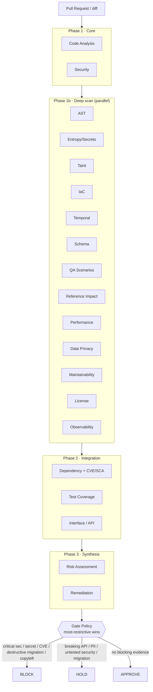
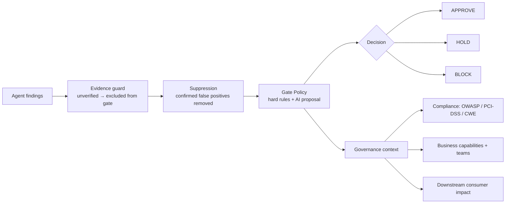

# CIAA — Pipeline & Gate Flow

How a pull request flows through the 20 agents and becomes an Approve / Hold / Block decision.

## Analysis pipeline



## From finding to decision



## ASCII fallback (if Mermaid doesn't render)

```
PR/diff
   │
   ▼
Phase 1   : Code Analysis · Security
   │
   ▼
Phase 1b  : AST · Entropy/Secrets · Taint · IaC · Temporal · Schema · QA ·
   │        Reference · Performance · Privacy · Maintainability · License · Observability   (parallel)
   ▼
Phase 2   : Dependency(+CVE/SCA) · Test Coverage · Interface/API
   │
   ▼
Phase 3   : Risk Assessment · Remediation
   │
   ▼
Evidence guard ─▶ Suppression ─▶ GATE POLICY (most-restrictive wins)
   │
   ├─ BLOCK   ← critical security · secret · CVE · destructive+irreversible migration · copyleft
   ├─ HOLD    ← breaking API · unencrypted PII · untested security method · migration · big blast radius
   └─ APPROVE ← no blocking evidence
                   │
                   └─▶ Governance: Compliance (OWASP/PCI/CWE) · Capabilities/teams · Consumer impact
```
